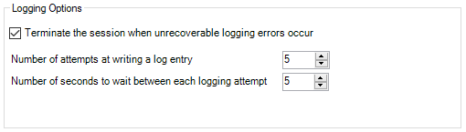
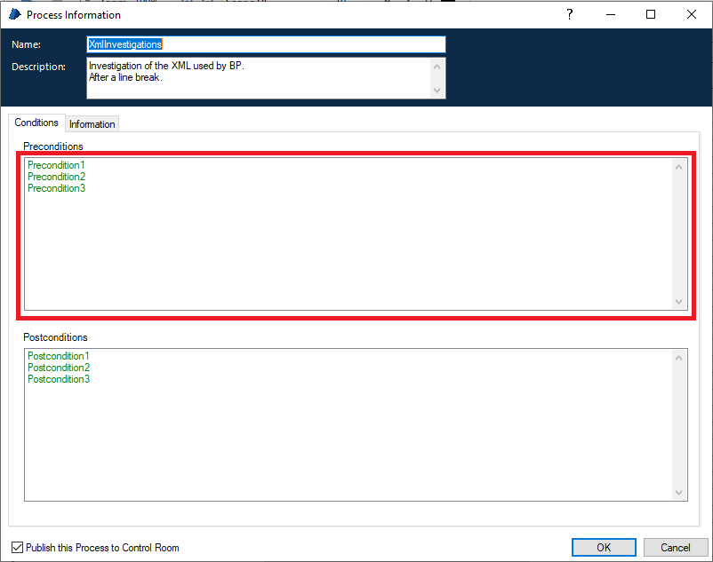
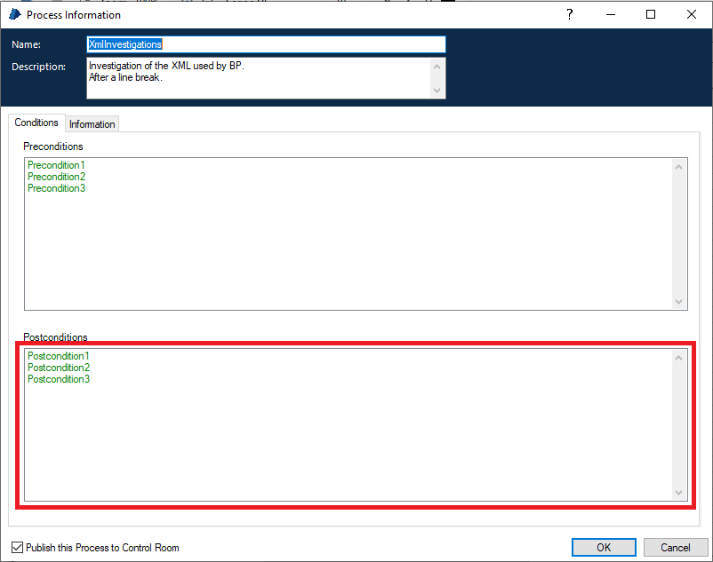

# Process XML referencia

## `<process />`

Az XML gyökere.

Attribútumai:

- name - process név.
- version - verziószám. Érdekes módon ezt a program felületéről nem lehet beállítani. Az általam vizsgált esetekben mindig "1.0" az értéke
- bpversion - Blue Prism verzió.
- narrative - A Main Page-en megjelenő Process Information dobozban megjelenő description szövege.
- byrefcollection - ??
- preferredid - A process ID-je (GUID).

Kapcsolódó tulajdonságokat tartalmazó al-tagek:

- [`<logging />`](#logging)
- [`<view />`](#view)
- [`<preconditions />`](#preconditions)
- [`<endpoint />`](#endpoint)
- [`<stage type="ProcessInfo">`](#stage)

További lehetséges tartalmazott tagek:

- `<stage />` - Minden process-en belüli egyéb elemet egy-egy stage tag reprezentál.
- `<subsheet />` - A további page-ek definíciói.

## `<logging />`

A Process Information doboz Information fülén található Logging Options csoport adatait tartalmazza.

Attribútumai:

- abort-on-error - (true/false)
- attempts - (egész szám)
- retry-period - (egész szám)

## `<view />`

A Main Page, vagy subsheet megjelenítési pozícióját és a nagyítás mértékét tartalmazza.

Tagek:

- [`<camerax />`](#camerax) - A megjelenítési pozíció X koorinátája
- [`<cameray />`](#cameray) - A megjelenítési pozíció Y koorinátája
- [`<zoom />`](#zoom) - A nagyítás mértéke.

## `<preconditions />`

A Process Information vagy Page Information doboz Conditions fülén található, Preconditions dobozában található bejegyzések.

Tagek:

- `<condition />` - Egy-egy precondition. Attribútumok:
  - narrative - A precondition szöveges formában.

## `<endpoint />`

A Process Information doboz Conditions fülén található, Postconditions dobozában található bejegyzések felsorolása.

Attribútumok:

- narrative - Az összes postcondition multiline stringként megadva.

## `<subsheet />`
  
A process egy page-ének definíciója.
Érdekes módon a pre- és postcondition adatok nem itt, hanem az oldalhoz tartozó start stage-ben vannak eltárolva.

Attribútumok:

- subsheetid - A page ID-je (GUID)
- type - A jelentése számomra nem világos, értéke az általam vizsgált példákban "Normal"
- published - Process esetén nincs jelentősége. Mindig "False"

Tagek:

- [`<name />`](#name) - A page neve.
- [`<view />`](#view) - Megjelenítési pozíció és nagyítás.

## `<name />`

A subsheet neve.

## `<zoom />`

A nagyítás mértéke. Tipikus értékek: 1.25 (100%) és 0.9375 (75%). A 0.625 (50%) már olvashatatlanul kicsi.

Attribútumok:

- version - Verzió, mindig "2".

## `<camerax />`

A megjelenítési pozíció X koorinátája.

## `<cameray />`

A megjelenítési pozíció Y koorinátája.

## `<stage />`

A processen belül egy stage-et definiál.

Attribútumok:

- stageid - A stage ID-ja (GUID)
- name - A stage neve
- type - A stage típusa. Valid értékek:
  - Action - VBO Page meghívása
  - Alert - Üzenet megjelenítése amikor a Process a Control Room-ból fut.
  - Anchor - Anchor, a linkek "megtörésére" szolgál.
  - Block - Block, a kivételkezelés határának kijelölésére szolgál, illetve Data elemek csoportosítására szokták még használni.
  - Calculation - Calculation, számítás eredményének betöltése Data stage-be
  - Choice - Többágú elágazás.
  - ChoiceEnd - A Choice végét jelöli, vizuálisan az Otherwise elemet jelöli
  - Collection - Összetett adatelem, a .NET DataTable BP-beli vizuális megfelelője
  - Data - A Data stage
  - Decision - Igen/Nem elágazás feltétel megadásával
  - End - Az End stage
  - Exception - Kivétel kiváltása
  - LoopEnd - Loop vége
  - LoopStart - Loop kezdete
  - MultipleCalculation - Hasonló a Calculation-höz, de több számítást foglal magába.
  - Note - Megjegyzés, de a folyamatábrának önálló lépése lehet.
  - Process - Process meghívása
  - ProcessInfo - Process Information doboz
  - Recover - Kivétel "elkapása"
  - Resume - Kivételkezelő folyamatrész lezárása
  - Start - A Start stage
  - SubSheet - Page meghívása
  - SubsheetInfo - Page Information doboz

Tagek:

- [`<subsheetid />`](#subheetid) - A tartalmazó page azonosítója.
- [`<narrative />`](#narrative) - A description szövege. Minden típus esetén.
- [`<displayx />`](#displayx) - X pozíció. Minden típus esetén.
- [`<displayy />`](#displayy) - Y pozíció. Minden típus esetén.
- [`<displaywidth />`](#displaywidth) - Szélesség. Minden típus esetén.
- [`<displayheight />`](#displayheight) - Magasság. Minden típus esetén.
- [``](#font) - Betűtípus. Minden típus esetén.
- [`<onsuccess />`](#onsuccess) - Sikeres végrehajtás után a következő stage azonosítója.
- [`<processid />`](#processid) - A futtatandó process azonosítója.  
- [`<inputs />`](#inputs) - A futtatandó process, subsheet, action input paraméterei.
- [`<outputs />`](#outputs) - A futtatandó process, subsheet, action output paraméterei.
- [`<resource />`](#resource) - A futtatandó action adatai.
- [`<datatype />`](#datatype) - A data stage adattípusa.
- [`<initialvalue />`](#initialvalue) - Kezdőérték.
- [`<private />`](#private) - A 'Hide from other pages in the process' checkbox kijelölése esetén van megadva.
- [`<alwaysinit />`](#alwaysinit) - A 'Reset to initial Value whenever this page runs' checkbox kijelölése esetén van megadva.
- [`<decision />`](#decision) - A Decision stage elágazást meghatározó kifejezése.
- [`<ontrue />`](#ontrue) - Következő stage ID-je igaz feltétel esetén.
- [`<onfalse />`](#onfalse) - Következő stage ID-je hamis feltétel esetén.
- [`<groupid` />](#groupid) - Több stage-et összefogó id.
- [`<calculation` />](#calculation) - A számítandó kifejezést és a cél Data stage-et tartalmazza.
- [`<steps` />](#steps) - (calculation elemeket tartalmaz - multiplecalculation)
- [`<collecioninfo` />](#collecioninfo) - (collection - kifejtendő, van alkifejezése!)
- [`<initialvalue` />](#initialvalue) - (collection - kifejtendő, van alkifejezése!)
- looptype
- loopdata
- alert
- exception

## Az összes stage esetén előforduló tagek
  
### `<subsheetid />`

A stage-et tartalmazó page azonosítója.

### `<narrative />`

A stage ablakban megjelenő Description szövege.

### `<displayx />`

A stage X pozíciója. (1 rácsnyi távolság: 15).

### `<displayy />`

A stage Y pozíciója. (1 rácsnyi távolság: 15).

### `<displaywidth />`

A stage szélessége. (1 rácsnyi távolság: 15).

### `<displayheight />`

A stage magassága. (1 rácsnyi távolság: 15).

### ``

A stage betűtípusa.

Attribútumok:

- family - Font family.
- size - Betűméret.
- style - Stílus. Valid értékek: Regular, Bold, Italic, Underline. Utóbbi három együtt is szerepelhet, vesszővel elválasztva.
- color - Szín. Hexadecimális RGB kód hashmark nélkül.

## Szelektíven előforduló tagek

### `<onsuccess />`

Sikeres végrehajtás után a következő stage azonosítója.
Az alábbi típusú stage-ek esetén értelmezett:

- Start
- Anchor
- Process
- SubSheet
- Action
- ChoiceEnd
- Calculation
- MultipleCalculation
- LoopStart
- LoopEnd
- Note
- Alert
- Recover
- Resume

### `<processid />`

A futtatandó process azonosítója.
Az alábbi típusú stage-ek esetén értelmezett:

- Process
- Subsheet

### `<inputs />`

A futtatandó process, subsheet, action input paraméterei.
Az alábbi típusú stage-ek esetén értelmezett:

- Start
- Process
- Subsheet
- Action

Tagek:

- [`<input` />](#input) - Input paraméter

### `<input />`

Input paraméter.

Attribútumok:

- type - Adattípus. Valid értékek:
  - collection
  - date
  - datetime
  - flag
  - number
  - password
  - text
  - time
  - timespan
  - image
  - binary
- name - A paraméter neve.
- narrative - A paraméter leírása.
- expr - A paraméter értékét adó kifejezés.

### `<outputs />`

A futtatandó process, subsheet vagy action output paraméterei.
Az alábbi típusú stage-ek esetén értelmezett:

- End
- Process
- Subsheet
- Action

Tagek:

- [`<output` />](#output) - Output paraméter

### `<output />`

Output paraméter.

Attribútumok:

- type - Adattípus. Valid értékek:
  - collection
  - date
  - datetime
  - flag
  - number
  - password
  - text
  - time
  - timespan
  - image
  - binary
- name - A paraméter neve.
- narrative - A paraméter leírása.
- stage - A paraméter értékét tároló stage (data vagy collection) neve.

### `<resource />`

A futtatandó action adatai.

> Csak Action típusú stage esetén értelmezett!

Attribútumok:

- object - A meghívandó subsheetet tartalmazó VBO neve.
- action - A meghívandó subsheet neve.

### `<datatype />`

A data stage adattípusa. Valid értékek:

- date
- datetime
- flag
- number
- password
- text
- time
- timespan
- image
- binary

### `<initialvalue />`

Kezdőérték.

> Csak data stage estén értelmezett!

Attribútumok:

- xml:space - text datatype esetén van megadva, értéke mindig "preserve"

### `<private />`

A 'Hide from other pages in the process' checkbox kijelölése esetén van megadva. Attribútum és érték nélkül.

> Csak data stage estén értelmezett!

### `<alwaysinit />`

A 'Reset to initial Value whenever this page runs' checkbox kijelölése esetén van megadva. Attribútum és érték nélkül.

> Csak data stage estén értelmezett!

### `<decision />`

A feltételt tartalmazó kifejezés.

> Csak decision stage estén értelmezett!

Attribútumok:

- expression - Kifejezés

### `<ontrue />`

A következő stage ID-je ha a megadott feltétel teljesül.

> Csak decision stage estén értelmezett!

### `<onfalse />`

A következő stage ID-je ha a megadott feltétel nem teljesül.

> Csak decision stage estén értelmezett!

### `<groupid />`

Több stage-et összefogó id (GUID)

Az alábbi típusú stage-ek esetén értelmezett:

- ChoiceStart
- ChoiceEnd
- LoopStart
- LoopEnd

### `<calculation />`

A kiszámítandó kifejezés és a stage neve, ahol eltárolásra kerül.

Attribútumok:

- expression - Kifejezés
- stage - A cél Data stage megnevezése

> Csak calculation stage estén értelmezett!
> 