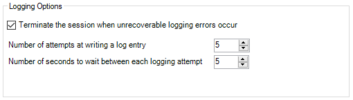
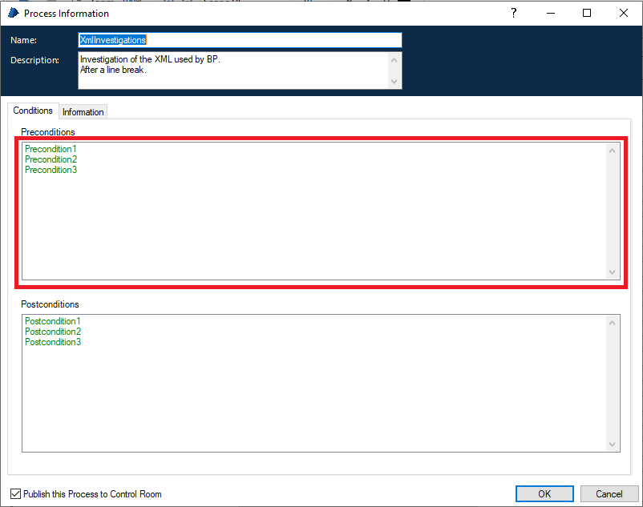
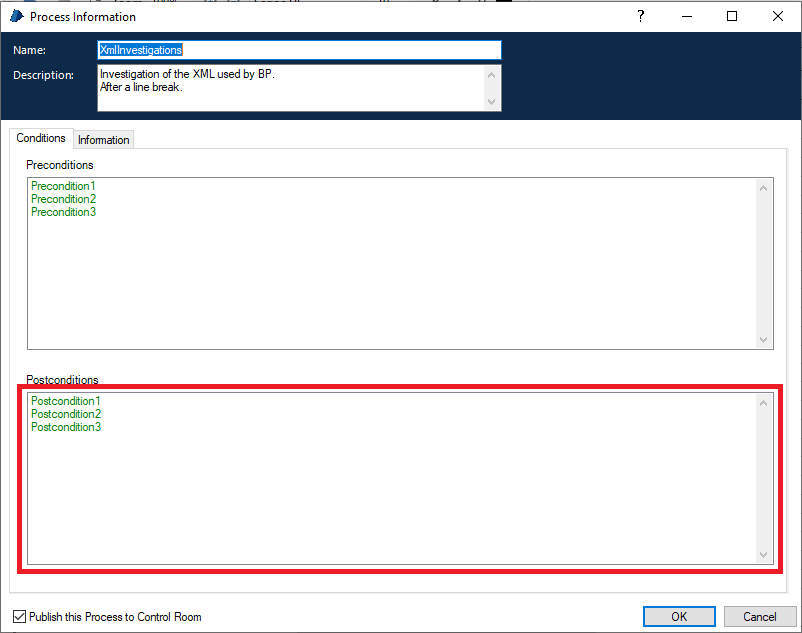

# Process XML referencia

### `<process />`

Az XML gyökere.

Attribútumai:

- name - process név.
- version - verziószám. Érdekes módon ezt a program felületéről nem lehet beállítani.
- bpversion - Blue Prism verzió.
- narrative - A Main Page-en megjelenő Process Information dobozban megjelenő description szövege.
- byrefcollection - ??
- preferredid - A process ID-je (GUID).

Kapcsolódó tulajdonságokat tartalmazó al-tagek:

- [`<logging />`](#logging)
- [`<view />`](#view) 
- [`<preconditions />`](#preconditions)
- [`<endpoint />`](#endpoint)
- [`<stage type="ProcessInfo">`](#stage)

További lehetséges tartalmazott tagek:

- `<stage />` - Minden process-en belüli egyéb elemet egy-egy stage tag reprezentál.
- `<subsheet />` - A további page-ek definíciói.

### `<logging />`

A Process Information doboz Information fülén található Logging Options csoport adatait tartalmazza.

Attribútumai:

- abort-on-error - (true/false)
- attempts - (egész szám) 
- retry-period - (egész szám)

### `<view />`

A Main Page megjelenítési pozícióját és a nagyítás mértékét tartalmazza.

Tagek:

- `<camerax />` - A megjelenítési pozíció X koorinátája
- `<cameray />` - A megjelenítési pozíció Y koorinátája
- `<zoom />` - A nagyítás mértéke. Tipikus értékek: 1.25 (100%) és 0.9375 (75%). A 0.625 (50%) már olvashatatlanul kicsi. Attribútumai:
  - version - Verzió, mindig "2".

### `<preconditions />`

A Process Information vagy Page Information doboz Conditions fülén található, Preconditions dobozában található bejegyzések.

Tagek:

- `<condition />` - Egy-egy precondition. Attribútumok:
  - narrative - A precondition szöveges formában.

### `<endpoint />`

A Process Information doboz Conditions fülén található, Postconditions dobozában található bejegyzések felsorolása.

Attribútumok:

- narrative - Az összes postcondition multiline stringként megadva.

### `<subsheet>`

A process egy page-ének definíciója.
Érdekes módon a pre- és postcondition adatok nem itt, hanem az oldalhoz tartozó start stage-ben vannak eltárolva.

Attribútumok:

- subsheetid - A page ID-je (GUID)
- type - A jelentése nem világos, értéke az általam vizsgált példákban "Normal"
- published - Process esetén nincs jelentősége. Mindig "False"

Tagek:

- `<name>` - A page neve.
- [`<view>`](#view) - Megjelenítési pozíció és nagyítás.

### `<stage>`

A processen belül egy stage-et definiál. 

Attribútumok:

- stageid - A stage ID-ja (GUID)
- name - A stage neve
- type - A stage típusa. Valid értékek:
  - Action - VBO Page meghívása
  - Alert - Üzenet megjelenítése amikor a Process a Control Room-ból fut.
  - Anchor - Anchor, a linkek "megtörésére" szolgál.
  - Block - Block, a kivételkezelés határának kijelölésére szolgál, illetve Data elemek csoportosítására szokták még használni.
  - Calculation - Calculation, számítás eredményének betöltése Data stage-be
  - Choice - Többágú elágazás.
  - ChoiceEnd - A Choice végét jelöli, vizuálisan az Otherwise elemet jelöli
  - Collection - Összetett adatelem, a .NET DataTable BP-beli vizuális megfelelője
  - Data - A Data stage
  - Decision - Igen/Nem elágazás feltétel megadásával
  - End - Az End stage
  - Exception - Kivétel kiváltása
  - LoopEnd - Loop vége
  - LoopStart - Loop kezdete
  - MultipleCalculation - Hasonló a Calculation-höz, de több számítást foglal magába.
  - Note - Megjegyzés, de a folyamatábrának önálló lépése lehet.
  - Process - Process meghívása
  - ProcessInfo - Process Information doboz
  - Recover - Kivétel "elkapása"
  - Resume - Kivételkezelő folyamatrész lezárása
  - Start - A Start stage
  - SubSheet - Page meghívása
  - SubsheetInfo - Page Information doboz
   
  