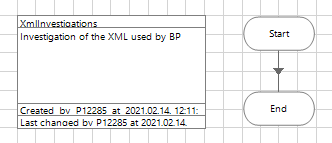
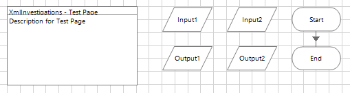
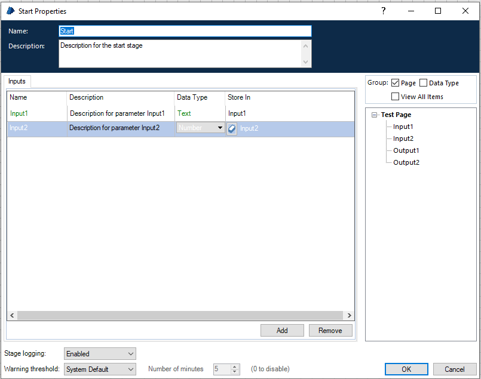

# Alap process

Alap process (XmlInvestigations) a Main Page mellett egy plusz Page-dzsel (Test Page), utóbbinál bemeneti és kimeneti paraméterek vannak beállítva és egy a Start stage-ből az Endbe egyenesen vezető link.

## Main Page

## Test Page

Start és End stage-ek (a paraméterezés bemutatására):

## Az XmlInvestigations process kiexportálás után

[BPA Process - XmlInvestigations.xml](xml_investigations/BPA%20Process%20-%20XmlInvestigations%20#1.xml)

## A tagek leírása

- A Main Page kitüntetett szerepet élvez, a rajta lévő stage-ek nincsenek megjelölve. A többi page stage-ei `<subsheetid />` tag segítségével vannak a tartalmazó page-hez rendelve.
- A Process Information dobozon belül feltüntetett elemek egy része a 
- 

- A process tagen az alábbi attribútumok vannak definiálva:

name="XmlInvestigations" version="1.0" bpversion="6.2.1.4272" narrative="Investigation of the XML used by BP" byrefcollection="true" preferredid="2e5f073d-6a70-4787-9d60-e3363fe28f1a"